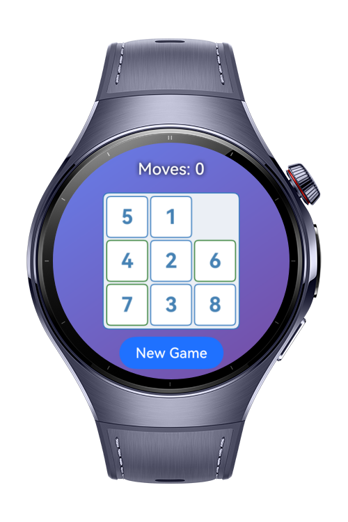
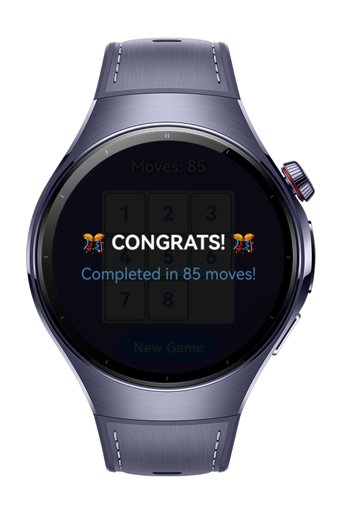

> **Note:** To access all shared projects, get information about environment setup, and view other guides, please visit [Explore-In-HMOS-Wearable Index](https://github.com/Explore-In-HMOS-Wearable/hmos-index).

# Sliding Puzzle

In the sliding puzzle game, players manipulate numbered tiles on a grid by sliding them into an empty space. The goal is
to arrange all tiles in sequential order from 1 to the highest number. Players can only move tiles that are adjacent to
the empty space, sliding them horizontally or vertically. The game is won when all tiles are positioned in their correct
numerical sequence, with the empty space in the bottom-right corner.

# Preview

<p align="left">
  
  
</p>

# Use Cases

Quick entertainment during free time with its simple yet addictive gameplay mechanics that keep players engaged.

# Tech Stack

- **Languages**: ArkTS, ArkUI
- **Frameworks**: HarmonyOS SDK 5.0.2(14)
- **Tools**: DevEco Studio Vers 5.1.0.820
- **Libraries**: @kit.ArkUI

# Directory Structure

```
entry/src/main/ets/
├───entryability
│       EntryAbility.ets
├───entrybackupability
│       EntryBackupAbility.ets
├───game
│       constants.ts
│       game.ts
│       puzzlecontroller.ets
│       puzzlerenderer.ets
│       slidingpuzzlegame.ets
│       types.ts
├───pages
│       Index.ets
└─── 
```


# Constraints and Restrictions

## Supported Devices

- Huawei Watch 5

# LICENSE

Snake is distributed under the terms of the MIT License.
See the [LICENSE](/LICENSE) for more information.